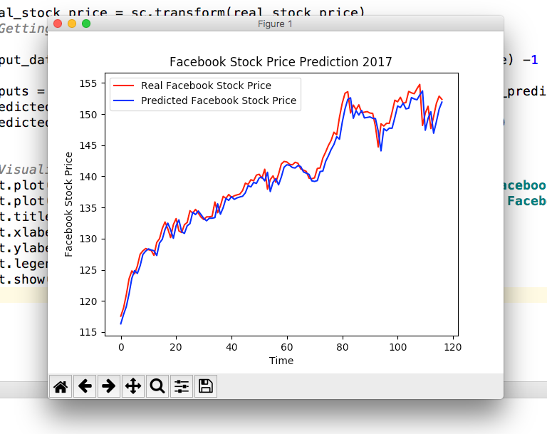

# rnn
Recurrent Neural Network examples

First example is a Regression Model:

    stock_price_rnn_prediction.py
    -------------------------------
    On the basis of the Facebook stock value for 2012-2016, the Recurrent Neural
    Network model is trying to predict the value for 2017.

    Being a Recurral Neural Network, the prediction is based on a base day,
    and the prediction is the stock exchange value of the next day

    As input for prediction i am using days from 1 until today -1 from stock exchange
    historical data for 2017

    As result I am comparing the next day value prediction with the next day value
    from stock exchange value

    Here's the plot :

     </img>
